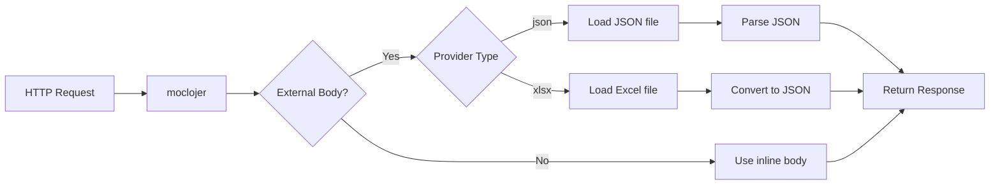

# External Bodies

Instead of embedding large response bodies directly in YAML configuration files, moclojer supports loading responses from external files. This keeps your configuration clean and enables powerful use cases like transforming Excel spreadsheets into REST APIs or proxying remote endpoints.

## 🎯 Why Use External Bodies?

**Problems with inline bodies:**

- ❌ Large JSON responses make YAML files hard to read
- ❌ Difficult to maintain complex data structures
- ❌ Version control diffs become messy
- ❌ Can't reuse existing data files

**Benefits of external bodies:**

- ✅ Keep YAML configuration clean and readable
- ✅ Reuse existing JSON files and datasets
- ✅ Proxy remote APIs without duplication
- ✅ Transform Excel spreadsheets into APIs
- ✅ Separate concerns (config vs data)



## 📝 Configuration

Replace `body` with `external-body`:

```yaml
- endpoint:
    method: GET
    path: /api/products
    response:
      status: 200
      headers:
        Content-Type: application/json
      external-body:
        provider: json
        path: data/products.json
```

### External Body Fields

| Field | Required | Description |
|-------|----------|-------------|
| `provider` | Yes | File type: `json` or `xlsx` |
| `path` | Yes | File path (local or HTTP URL) |
| `sheet-name` | No | Excel sheet name (xlsx only) |

## 📄 JSON Provider

### Local File

```yaml
- endpoint:
    method: GET
    path: /api/users
    response:
      status: 200
      headers:
        Content-Type: application/json
      external-body:
        provider: json
        path: data/users.json
```

**File: `data/users.json`**

```json
{
  "users": [
    {"id": 1, "name": "Alice", "email": "alice@example.com"},
    {"id": 2, "name": "Bob", "email": "bob@example.com"}
  ],
  "total": 2
}
```

**Request:**

```bash
curl http://localhost:8000/api/users
```

**Response:**

```json
{
  "users": [
    {"id": 1, "name": "Alice", "email": "alice@example.com"},
    {"id": 2, "name": "Bob", "email": "bob@example.com"}
  ],
  "total": 2
}
```

### Remote URL (API Proxy)

Proxy responses from real APIs:

```yaml
- endpoint:
    method: GET
    path: /pokemon/:name
    response:
      status: 200
      headers:
        Content-Type: application/json
      external-body:
        provider: json
        path: https://pokeapi.co/api/v2/pokemon/{{path-params.name}}
```

**Request:**

```bash
curl http://localhost:8000/pokemon/pikachu
```

**Response:** (proxied from pokeapi.co)

```json
{
  "name": "pikachu",
  "abilities": [...],
  "types": [...]
}
```

### Template Variables in Paths

Use template variables to make paths dynamic:

```yaml
- endpoint:
    method: GET
    path: /api/users/:userId/profile
    response:
      status: 200
      external-body:
        provider: json
        path: data/users/{{path-params.userId}}/profile.json
```

**File structure:**

```
data/
  users/
    1/
      profile.json
    2/
      profile.json
```

## 📊 Excel (XLSX) Provider

Transform Excel spreadsheets into REST APIs:

```yaml
- endpoint:
    method: GET
    path: /api/employees
    response:
      status: 200
      headers:
        Content-Type: application/json
      external-body:
        provider: xlsx
        path: data/employees.xlsx
        sheet-name: Sheet1
```

**Excel file: `data/employees.xlsx`**

| id | name | department | salary |
|----|------|------------|--------|
| 1 | Alice | Engineering | 85000 |
| 2 | Bob | Marketing | 65000 |
| 3 | Charlie | Sales | 70000 |

**Request:**

```bash
curl http://localhost:8000/api/employees
```

**Response:**

```json
[
  {"id": 1, "name": "Alice", "department": "Engineering", "salary": 85000},
  {"id": 2, "name": "Bob", "department": "Marketing", "salary": 65000},
  {"id": 3, "name": "Charlie", "department": "Sales", "salary": 70000}
]
```

### Multiple Sheets

```yaml
# Engineering department
- endpoint:
    method: GET
    path: /api/departments/engineering
    response:
      status: 200
      external-body:
        provider: xlsx
        path: company-data.xlsx
        sheet-name: Engineering

# Marketing department
- endpoint:
    method: GET
    path: /api/departments/marketing
    response:
      status: 200
      external-body:
        provider: xlsx
        path: company-data.xlsx
        sheet-name: Marketing
```

## 🌐 Real-World Use Cases

### 1. Product Catalog from Excel

Non-technical teams can update product data:

```yaml
- endpoint:
    method: GET
    path: /api/v1/products
    response:
      status: 200
      external-body:
        provider: xlsx
        path: catalog/products-{{query-params.category|default:all}}.xlsx
        sheet-name: Products
```

**Benefits:**

- Business team updates Excel directly
- No code changes needed
- Version control for data files
- Easy imports from existing systems

### 2. Multi-Environment API Proxy

```yaml
# Development: Use local mock data
- endpoint:
    method: GET
    path: /api/orders
    response:
      status: 200
      external-body:
        provider: json
        path: mocks/dev/orders.json

# Staging: Proxy to staging API
- endpoint:
    host: api-staging.example.com
    method: GET
    path: /api/orders
    response:
      status: 200
      external-body:
        provider: json
        path: https://api-staging.example.com/api/orders

# Production: Proxy to production API
- endpoint:
    host: api.example.com
    method: GET
    path: /api/orders
    response:
      status: 200
      external-body:
        provider: json
        path: https://api.example.com/api/orders
```

### 3. Testing with Real Data Samples

```yaml
- endpoint:
    method: GET
    path: /api/test/users/:scenario
    response:
      status: 200
      external-body:
        provider: json
        path: test-data/{{path-params.scenario}}.json
```

**File structure:**

```
test-data/
  happy-path.json
  edge-cases.json
  error-scenarios.json
  large-dataset.json
```

### 4. Financial Reports from Spreadsheets

```yaml
- endpoint:
    method: GET
    path: /api/reports/quarterly/:quarter
    response:
      status: 200
      headers:
        Content-Type: application/json
      external-body:
        provider: xlsx
        path: reports/Q{{path-params.quarter}}-2025.xlsx
        sheet-name: Summary
```

## 🔧 Advanced Patterns

### Combining Template Variables and External Bodies

```yaml
- endpoint:
    method: GET
    path: /api/:tenantId/config
    response:
      status: 200
      external-body:
        provider: json
        path: configs/{{path-params.tenantId}}/settings.json
```

### Fallback to Inline Body

When file doesn't exist, use inline body as fallback:

```yaml
# Primary: Try external file
- endpoint:
    method: GET
    path: /api/feature-flags
    response:
      status: 200
      external-body:
        provider: json
        path: features/{{header-params.Environment|default:dev}}.json

# Fallback: Default config
- endpoint:
    method: GET
    path: /api/feature-flags
    response:
      status: 200
      body: >
        {
          "features": {
            "newUI": false,
            "analytics": false
          }
        }
```

### Conditional External Bodies

Use different files based on request:

```yaml
- endpoint:
    method: GET
    path: /api/data
    response:
      status: 200
      external-body:
        provider: json
        path: data/{{query-params.version|default:v1}}/response.json
```

**Requests:**

```bash
curl http://localhost:8000/api/data              # uses data/v1/response.json
curl http://localhost:8000/api/data?version=v2  # uses data/v2/response.json
```

## ✅ Best Practices

**Do:**

- ✅ Use external bodies for responses > 50 lines
- ✅ Organize files in logical directories (`data/`, `mocks/`, `fixtures/`)
- ✅ Use meaningful file names (`users.json`, not `data1.json`)
- ✅ Version control your data files alongside config
- ✅ Use relative paths for portability
- ✅ Document file structure in README

**Don't:**

- ❌ Mix local and remote paths without clear documentation
- ❌ Use absolute paths (breaks portability)
- ❌ Store sensitive data in external files (use environment variables)
- ❌ Forget to validate Excel sheet names (typos cause errors)
- ❌ Use external bodies for tiny responses (overkill)

## 📁 File Organization

### Recommended Structure

```
project/
├── moclojer.yml              # Configuration
├── data/                     # External bodies
│   ├── users.json
│   ├── products.json
│   └── departments.xlsx
├── mocks/                    # Environment-specific
│   ├── dev/
│   │   └── orders.json
│   ├── staging/
│   │   └── orders.json
│   └── production/
│       └── orders.json
└── fixtures/                 # Test scenarios
    ├── happy-path.json
    └── edge-cases.json
```

## 🧪 Testing External Bodies

### Verify File Paths

```bash
# Test if file is accessible
cat data/users.json

# Test if Excel file exists
ls -la data/employees.xlsx
```

### Test with curl

```bash
# Local file
curl http://localhost:8000/api/users

# Remote proxy
curl http://localhost:8000/pokemon/pikachu

# Excel endpoint
curl http://localhost:8000/api/employees
```

### Validate JSON Files

```bash
# Check JSON syntax
jq . data/users.json

# Pretty-print
jq '.' data/users.json
```

## 🔍 Debugging

### Common Issues

| Issue | Solution |
|-------|----------|
| File not found | Check path is relative to moclojer working directory |
| Excel sheet not found | Verify sheet name matches exactly (case-sensitive) |
| Invalid JSON | Validate file with `jq` or online validator |
| Remote URL timeout | Check network connectivity, increase timeout |
| Template variable not replaced | Ensure variable exists in request |

### Enable Debug Logging

```bash
MOCLOJER_LOG_LEVEL=debug moclojer --config moclojer.yml
```

### Check File Paths

```yaml
# Print current directory
- endpoint:
    method: GET
    path: /debug/cwd
    response:
      status: 200
      body: "Current working directory: {{env.PWD}}"
```

## 📊 Performance Considerations

| Provider | File Size | Load Time | Caching |
|----------|-----------|-----------|---------|
| **JSON (local)** | < 1MB | < 10ms | Yes |
| **JSON (remote)** | < 1MB | 100-500ms | No (fresh each time) |
| **XLSX (local)** | < 5MB | 50-200ms | Yes |

**Tips:**

- Keep local JSON files under 1MB for fast responses
- Use remote URLs sparingly (network latency)
- Large Excel files (> 10MB) may slow startup time
- Consider caching for frequently accessed remote URLs

## 🚨 Important Notes

> **Path Resolution:** Paths are relative to the directory where moclojer is executed, not the config file location.

> **Remote URLs:** Fetched on every request (no caching). Use for dynamic data or infrequently accessed endpoints.

> **Excel Limitations:** Only `.xlsx` format supported (not `.xls` or `.csv`). First row must be headers.

> **Template Variables:** Work in `path` field but not inside the loaded file content.

## 📚 See Also

- **[Template Variables](../topics/templates/template-variables.md)** - Using variables in file paths
- **[Path Parameters](../topics/parameters/path-parameters.md)** - Dynamic file loading
- **[Multi-Domain Support](multi-domain-support.md)** - Different files per environment
- **[Real-World Example](../getting-started/real-world-example.md)** - Complete examples
