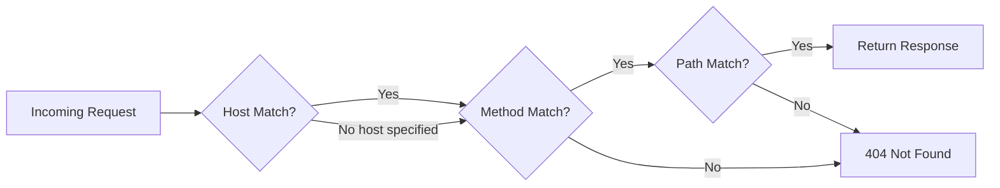

# Multi-Domain Support

moclojer supports routing requests based on the `Host` header, enabling you to serve different responses for different domains or subdomains on the same server instance. This is essential for multi-tenant applications, environment-specific mocks, and subdomain-based routing.

## 🎯 How Multi-Domain Routing Works

When a request arrives, moclojer matches endpoints using:

1. **Host** (if specified in endpoint configuration)
2. **HTTP Method** (GET, POST, etc.)
3. **Path pattern** (exact → parameters → wildcards)



## 📝 Basic Configuration

### Single Domain Endpoint

```yaml
- endpoint:
    host: api.example.com
    method: GET
    path: /users
    response:
      status: 200
      body: >
        {
          "domain": "api.example.com",
          "users": ["alice", "bob"]
        }
```

**Request:**
```bash
curl -H "Host: api.example.com" http://localhost:8000/users
```

**Response:**
```json
{
  "domain": "api.example.com",
  "users": ["alice", "bob"]
}
```

## 🌐 Multi-Tenant Applications

Serve different data based on subdomain:

```yaml
# Tenant A
- endpoint:
    host: tenant-a.saas.com
    method: GET
    path: /api/settings
    response:
      status: 200
      body: >
        {
          "tenant": "A",
          "database": "tenant_a_db",
          "features": ["analytics", "exports"]
        }

# Tenant B
- endpoint:
    host: tenant-b.saas.com
    method: GET
    path: /api/settings
    response:
      status: 200
      body: >
        {
          "tenant": "B",
          "database": "tenant_b_db",
          "features": ["analytics"]
        }

# Default tenant (no host specified)
- endpoint:
    method: GET
    path: /api/settings
    response:
      status: 200
      body: >
        {
          "tenant": "default",
          "database": "default_db",
          "features": []
        }
```

**Testing:**
```bash
# Tenant A
curl -H "Host: tenant-a.saas.com" http://localhost:8000/api/settings

# Tenant B
curl -H "Host: tenant-b.saas.com" http://localhost:8000/api/settings

# Default
curl http://localhost:8000/api/settings
```

## 🔧 Environment-Specific Mocks

Different responses for staging vs production:

```yaml
# Production API
- endpoint:
    host: api.example.com
    method: GET
    path: /v1/products
    response:
      status: 200
      body: >
        {
          "environment": "production",
          "products": [
            {"id": 1, "name": "Widget", "price": 19.99}
          ]
        }

# Staging API
- endpoint:
    host: api-staging.example.com
    method: GET
    path: /v1/products
    response:
      status: 200
      body: >
        {
          "environment": "staging",
          "products": [
            {"id": 1, "name": "Widget (Test)", "price": 0.01}
          ]
        }

# Development API
- endpoint:
    host: api-dev.example.com
    method: GET
    path: /v1/products
    response:
      status: 200
      body: >
        {
          "environment": "development",
          "products": [
            {"id": 1, "name": "Widget (Dev)", "price": 1.00}
          ]
        }
```

## 🌍 Subdomain-Based API Versioning

Version your API using subdomains:

```yaml
# v1 API
- endpoint:
    host: v1.api.example.com
    method: GET
    path: /users/:id
    response:
      status: 200
      body: >
        {
          "id": {{path-params.id}},
          "name": "User {{path-params.id}}",
          "api_version": "1.0"
        }

# v2 API (different response structure)
- endpoint:
    host: v2.api.example.com
    method: GET
    path: /users/:id
    response:
      status: 200
      body: >
        {
          "data": {
            "id": {{path-params.id}},
            "fullName": "User {{path-params.id}}",
            "profile": {
              "created": "2025-01-01"
            }
          },
          "meta": {
            "version": "2.0"
          }
        }
```

## 🔄 Mixed Configuration

Combine host-specific and host-agnostic endpoints:

```yaml
# Specific domain endpoint
- endpoint:
    host: admin.example.com
    method: GET
    path: /dashboard
    response:
      status: 200
      body: >
        {"message": "Admin Dashboard", "privileged": true}

# Same path, different domain
- endpoint:
    host: user.example.com
    method: GET
    path: /dashboard
    response:
      status: 200
      body: >
        {"message": "User Dashboard", "privileged": false}

# Fallback (no host specified = matches any domain)
- endpoint:
    method: GET
    path: /health
    response:
      status: 200
      body: >
        {"status": "ok"}
```

## 🧪 Testing Multi-Domain Locally

### Using curl with Host header

```bash
# Test specific domains
curl -H "Host: tenant-a.example.com" http://localhost:8000/api/data
curl -H "Host: tenant-b.example.com" http://localhost:8000/api/data

# Test without Host header (fallback)
curl http://localhost:8000/api/data
```

### Using /etc/hosts for local DNS

Edit `/etc/hosts` (Linux/Mac) or `C:\Windows\System32\drivers\etc\hosts` (Windows):

```
127.0.0.1   tenant-a.localhost
127.0.0.1   tenant-b.localhost
127.0.0.1   api.localhost
```

Then access directly:
```bash
curl http://tenant-a.localhost:8000/api/data
curl http://tenant-b.localhost:8000/api/data
```

### Using Docker with custom network

```yaml
# docker-compose.yml
version: '3.8'
services:
  moclojer:
    image: ghcr.io/moclojer/moclojer:latest
    ports:
      - "8000:8000"
    volumes:
      - ./mocks.yml:/app/moclojer.yml
    networks:
      app_network:
        aliases:
          - api.example.com
          - api-staging.example.com

networks:
  app_network:
    driver: bridge
```

## 📊 Real-World Use Cases

| Use Case | Configuration | Benefit |
|----------|---------------|---------|
| **Multi-tenant SaaS** | Different `host` per customer | Isolate customer data |
| **Environment parity** | staging/prod hosts | Test environment-specific behavior |
| **API versioning** | v1/v2 subdomains | Maintain multiple API versions |
| **Region-specific APIs** | us/eu/asia hosts | Simulate regional endpoints |
| **White-label apps** | Partner-specific domains | Test branded experiences |

## ✅ Best Practices

**Do:**
- ✅ Use host-specific endpoints for multi-tenant isolation
- ✅ Provide fallback endpoints without `host` for common resources
- ✅ Document which domains are expected in production
- ✅ Test with actual Host headers locally
- ✅ Use environment variables for dynamic host configuration

**Don't:**
- ❌ Mix host-specific and host-agnostic endpoints for the same path without clear intent
- ❌ Forget to test Host header matching in CI/CD
- ❌ Hardcode production domains in development mocks
- ❌ Rely on DNS resolution in tests (use Host headers instead)

## 🔧 Advanced Patterns

### Dynamic Host Matching

Use template variables to respond with the requested host:

```yaml
- endpoint:
    host: "{{header-params.Host}}"
    method: GET
    path: /hostname
    response:
      status: 200
      body: >
        {
          "requested_host": "{{header-params.Host}}",
          "server": "moclojer"
        }
```

### Conditional Responses Based on Host

```yaml
- endpoint:
    method: POST
    path: /api/orders
    response:
      status: 201
      body: >
        {
          "order_id": "{{json-params.id}}",
          "environment": "{{header-params.Host}}"
        }
    webhook:
      if: header-params.Host = "api.example.com"
      url: https://prod-webhook.example.com/orders
      method: POST
```

## 🚨 Important Notes

> **Host Matching is Exact:** The `host` field requires exact matches. `api.example.com` will not match `www.api.example.com`.

> **Fallback Behavior:** Endpoints without a `host` field act as fallbacks and will match any domain.

> **Case Sensitivity:** Host matching is case-insensitive (follows HTTP spec).

> **Port Numbers:** When specifying hosts, include ports if needed: `api.example.com:8080`

## 📚 See Also

- **[Request Matching](../topics/request-matching.md)** - How moclojer matches requests
- **[Header Parameters](../topics/parameters/header-parameters.md)** - Accessing Host header in templates
- **[Docker Deployment](../how-to/deployment/docker.md)** - Multi-domain Docker setup
- **[Real-World Example](../getting-started/real-world-example.md)** - E-commerce with multiple endpoints
