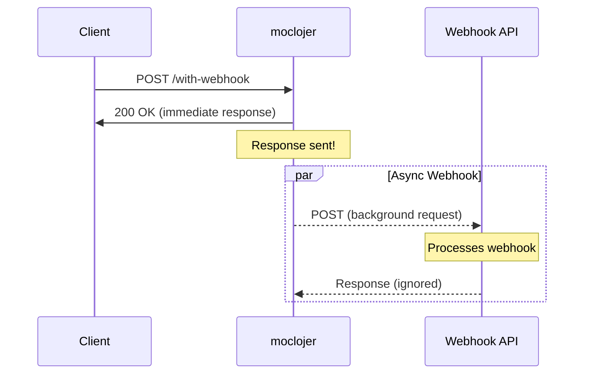

# Webhook Integration

Webhooks allow moclojer to send asynchronous background requests to external APIs when an endpoint receives a request. This enables realistic simulation of real-world integrations like notifications, logging, and third-party callbacks.

## 🎯 How Webhooks Work

When an endpoint with a webhook configuration receives a request:

1. **moclojer responds immediately** to the client with the configured response
2. **In parallel**, moclojer sends an asynchronous HTTP request to the webhook URL
3. **The webhook executes independently** without blocking the original response



## 📝 Basic Configuration

```yaml
- endpoint:
    method: POST
    path: /orders
    response:
      status: 201
      body: >
        {
          "id": "{{json-params.id}}",
          "status": "created"
        }
    webhook:
      url: https://api.example.com/notifications
      method: POST
      body: >
        {
          "order_id": "{{json-params.id}}",
          "event": "order.created",
          "timestamp": "{{now}}"
        }
```

**What happens:**
1. Client sends POST to `/orders`
2. moclojer responds with `201 Created` immediately
3. moclojer sends POST to `https://api.example.com/notifications` in the background

## 🔧 Webhook Configuration Options

### Required Fields

| Field | Description | Example |
|-------|-------------|---------|
| `url` | Target webhook endpoint URL | `https://api.slack.com/webhooks/...` |
| `method` | HTTP method | `POST`, `PUT`, `PATCH` |

### Optional Fields

| Field | Default | Description |
|-------|---------|-------------|
| `sleep-time` | `60` | Delay in seconds before sending webhook |
| `if` | `true` | Conditional expression to trigger webhook |
| `body` | (empty) | Request body (supports templates) |
| `headers` | `{}` | Custom headers |

## ⏱️ Delayed Webhooks

Simulate processing delays with `sleep-time`:

```yaml
- endpoint:
    method: POST
    path: /payment
    response:
      status: 202
      body: >
        {
          "payment_id": "{{json-params.payment_id}}",
          "status": "processing"
        }
    webhook:
      sleep-time: 120  # Wait 2 minutes
      url: https://api.example.com/payment-complete
      method: POST
      body: >
        {
          "payment_id": "{{json-params.payment_id}}",
          "status": "completed",
          "processed_at": "{{now}}"
        }
```

**Use case:** Simulate payment processing that takes time to complete.

## 🎛️ Conditional Webhooks

Use `if` conditions to trigger webhooks based on request data:

```yaml
- endpoint:
    method: POST
    path: /users
    response:
      status: 201
      body: >
        {
          "id": "{{json-params.id}}",
          "email": "{{json-params.email}}"
        }
    webhook:
      if: json-params.premium = "true"
      url: https://api.example.com/welcome-premium
      method: POST
      body: >
        {
          "user_id": "{{json-params.id}}",
          "plan": "premium"
        }
```

### Supported Operators

| Operator | Description | Example |
|----------|-------------|---------|
| `=` | Equals | `json-params.status = "active"` |
| `>` | Greater than | `json-params.amount > 100` |
| `<` | Less than | `json-params.age < 18` |
| `>=` | Greater or equal | `json-params.score >= 50` |
| `<=` | Less or equal | `query-params.limit <= 100` |

### Accessing Request Data in Conditions

```yaml
# Path parameters
if: path-params.userId = "123"

# Query parameters
if: query-params.status = "confirmed"

# JSON body fields
if: json-params.amount > 1000

# Header values
if: header-params.X-Environment = "production"
```

## 🌐 Real-World Examples

### Example 1: Slack Notification

```yaml
- endpoint:
    method: POST
    path: /deployments
    response:
      status: 201
      body: >
        {
          "deployment_id": "{{json-params.id}}",
          "status": "deploying"
        }
    webhook:
      url: https://hooks.slack.com/services/YOUR/WEBHOOK/URL
      method: POST
      body: >
        {
          "text": "🚀 Deployment started: {{json-params.service}} to {{json-params.environment}}",
          "username": "Deploy Bot"
        }
```

### Example 2: Analytics Tracking

```yaml
- endpoint:
    method: POST
    path: /api/checkout
    response:
      status: 200
      body: >
        {
          "order_id": "{{json-params.order_id}}",
          "total": {{json-params.total}}
        }
    webhook:
      url: https://analytics.example.com/track
      method: POST
      headers:
        Authorization: "Bearer YOUR_TOKEN"
      body: >
        {
          "event": "purchase",
          "properties": {
            "order_id": "{{json-params.order_id}}",
            "amount": {{json-params.total}},
            "user_id": "{{json-params.user_id}}"
          }
        }
```

### Example 3: Multi-Service Integration

```yaml
- endpoint:
    method: POST
    path: /api/orders
    response:
      status: 201
      body: >
        {
          "order_id": "{{json-params.id}}",
          "status": "confirmed"
        }
    webhook:
      if: json-params.total > 100
      sleep-time: 5
      url: https://api.payment-gateway.com/process
      method: POST
      headers:
        Content-Type: application/json
        X-API-Key: "{{header-params.X-API-Key}}"
      body: >
        {
          "order_id": "{{json-params.id}}",
          "amount": {{json-params.total}},
          "customer_email": "{{json-params.email}}"
        }
```

## 🧪 Testing Webhooks

### Using Request Bin

1. Create a request bin at [webhook.site](https://webhook.site)
2. Copy the unique URL
3. Configure your webhook:

```yaml
webhook:
  url: https://webhook.site/your-unique-id
  method: POST
  body: >
    {"test": "data"}
```

4. Make a request to your endpoint
5. View the webhook payload at webhook.site

### Local Testing with ngrok

```bash
# Start your local service
python -m http.server 8080

# Expose it with ngrok
ngrok http 8080

# Use the ngrok URL in your webhook
webhook:
  url: https://your-ngrok-url.ngrok.io/webhook
```

## ✅ Best Practices

**Do:**
- ✅ Use `sleep-time` to simulate realistic processing delays
- ✅ Add conditions with `if` to trigger webhooks selectively
- ✅ Include correlation IDs for tracing (use `{{json-params.correlation_id}}`)
- ✅ Test webhooks with request bins before production integration
- ✅ Use template variables to pass dynamic data

**Don't:**
- ❌ Rely on webhook responses (they're ignored by design)
- ❌ Use webhooks for critical synchronous operations
- ❌ Set `sleep-time` too high in tests (slows down test suites)
- ❌ Expose sensitive credentials in webhook URLs

## 🔒 Security Considerations

```yaml
# ✅ Good: Use environment variables for sensitive data
webhook:
  url: "{{env.WEBHOOK_URL}}"
  headers:
    Authorization: "Bearer {{env.WEBHOOK_TOKEN}}"

# ❌ Bad: Hardcoded credentials
webhook:
  url: https://api.example.com/webhook?token=secret123
```

## 📊 Use Cases

| Scenario | Configuration |
|----------|---------------|
| **Order confirmation email** | `sleep-time: 0`, immediate notification |
| **Payment processing** | `sleep-time: 60-300`, simulate processing time |
| **Conditional alerts** | `if: json-params.priority = "high"` |
| **Multi-step workflows** | Chain webhooks with delays |
| **Third-party integrations** | Slack, Discord, analytics platforms |

## 🚨 Important Notes

> **Asynchronous Execution:** moclojer does not wait for webhook responses. The webhook executes in the background and its response is ignored.

> **No Retries:** Failed webhooks are not automatically retried. For production use, implement retry logic in your actual backend.

> **Template Support:** Webhooks support all template variables: `path-params.*`, `query-params.*`, `json-params.*`, `header-params.*`, and `{{now}}`.

## 📚 See Also

- **[Template Variables](../topics/templates/template-variables.md)** - All available template variables
- **[Path Parameters](../topics/parameters/path-parameters.md)** - Using path params in webhooks
- **[Header Parameters](../topics/parameters/header-parameters.md)** - Forwarding headers
- **[Real-World Example](../getting-started/real-world-example.md)** - Complete e-commerce example
