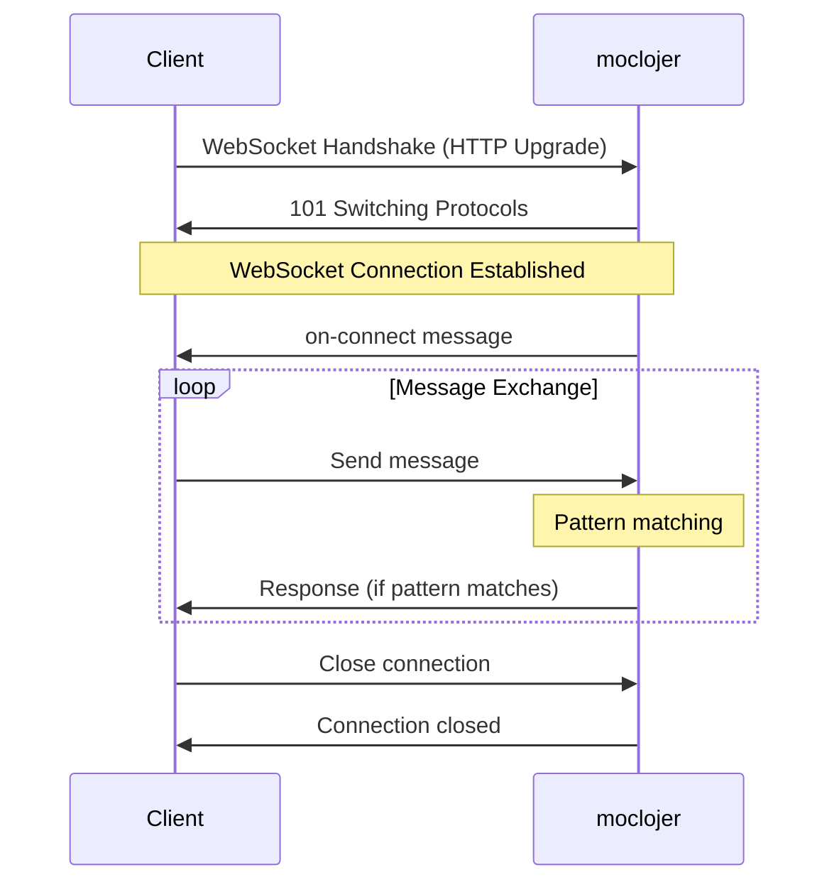

# WebSocket Support

moclojer supports WebSocket endpoints, enabling real-time bidirectional communication between client and server. This is essential for testing chat applications, live notifications, collaborative editing, and any real-time features without requiring a live WebSocket server.

## 🎯 How WebSockets Work in moclojer

WebSocket connections maintain a persistent bidirectional channel:

1. **Client initiates** WebSocket handshake
2. **Server sends** `on-connect` message (welcome/initialization)
3. **Client sends** messages
4. **Server matches** message patterns and responds
5. **Connection persists** until explicitly closed



## 📝 Basic Configuration

### Simple Echo Server

```yaml
- websocket:
    path: /ws/echo
    on-connect:
      response: '{"status": "connected", "message": "Welcome to Echo Server!"}'
    on-message:
      - pattern: "ping"
        response: "pong"
      - pattern: '{"echo": "{{json-params.echo}}"}'
        response: '{"echoed": "{{json-params.echo}}"}'
```

**Testing:**

```bash
# Using websocat
websocat ws://localhost:8000/ws/echo

# Or wscat
wscat -c ws://localhost:8000/ws/echo
```

**Interaction:**

```text
< {"status": "connected", "message": "Welcome to Echo Server!"}
> ping
< pong
> {"echo": "hello world"}
< {"echoed": "hello world"}
```

## 🔧 WebSocket Configuration

### Required Fields

| Field | Description |
|-------|-------------|
| `path` | WebSocket endpoint path (e.g., `/ws/chat`) |

### Optional Fields

| Field | Description | Default |
|-------|-------------|---------|
| `on-connect` | Message sent when client connects | (none) |
| `on-message` | List of message patterns and responses | `[]` |

### Message Pattern Matching

Each `on-message` entry supports:

| Field | Description |
|-------|-------------|
| `pattern` | Message pattern to match (string or JSON with templates) |
| `response` | Response to send when pattern matches |

## 💬 Chat Application

Real-time chat with username support:

```yaml
- websocket:
    path: /ws/chat/:room
    on-connect:
      response: >
        {
          "type": "system",
          "room": "{{path-params.room}}",
          "message": "Connected to room {{path-params.room}}",
          "timestamp": "{{now}}"
        }
    on-message:
      # User joins with username
      - pattern: '{"action": "join", "username": "{{json-params.username}}"}'
        response: >
          {
            "type": "system",
            "message": "{{json-params.username}} joined the room",
            "timestamp": "{{now}}"
          }

      # User sends message
      - pattern: '{"action": "message", "text": "{{json-params.text}}"}'
        response: >
          {
            "type": "message",
            "username": "{{json-params.username}}",
            "text": "{{json-params.text}}",
            "timestamp": "{{now}}"
          }

      # User leaves
      - pattern: '{"action": "leave"}'
        response: >
          {
            "type": "system",
            "message": "{{json-params.username}} left the room",
            "timestamp": "{{now}}"
          }
```

**Testing the chat:**

```javascript
const ws = new WebSocket('ws://localhost:8000/ws/chat/general');

ws.onopen = () => {
  // Join room
  ws.send(JSON.stringify({
    action: 'join',
    username: 'Alice'
  }));

  // Send message
  ws.send(JSON.stringify({
    action: 'message',
    username: 'Alice',
    text: 'Hello everyone!'
  }));
};

ws.onmessage = (event) => {
  console.log('Received:', JSON.parse(event.data));
};
```

## 🔔 Real-Time Notifications

Live notification feed:

```yaml
- websocket:
    path: /ws/notifications/:userId
    on-connect:
      response: >
        {
          "type": "connection",
          "userId": "{{path-params.userId}}",
          "message": "Notification feed connected",
          "unread": 0
        }
    on-message:
      # Subscribe to notification types
      - pattern: '{"action": "subscribe", "types": ["{{json-params.types}}"]}'
        response: >
          {
            "type": "subscription",
            "subscribed": {{json-params.types}},
            "message": "Subscribed to notifications"
          }

      # Mark notification as read
      - pattern: '{"action": "read", "notificationId": "{{json-params.notificationId}}"}'
        response: >
          {
            "type": "ack",
            "notificationId": "{{json-params.notificationId}}",
            "status": "read"
          }

      # Request unread count
      - pattern: '{"action": "getUnread"}'
        response: >
          {
            "type": "unread",
            "count": 5,
            "notifications": [
              {"id": 1, "message": "New comment"},
              {"id": 2, "message": "New follower"}
            ]
          }
```

## 📊 Live Dashboard Updates

Real-time metrics and stats:

```yaml
- websocket:
    path: /ws/dashboard
    on-connect:
      response: >
        {
          "type": "snapshot",
          "data": {
            "users": 1523,
            "revenue": 45230.50,
            "orders": 342
          },
          "timestamp": "{{now}}"
        }
    on-message:
      # Request latest metrics
      - pattern: '{"action": "refresh"}'
        response: >
          {
            "type": "update",
            "data": {
              "users": 1524,
              "revenue": 45350.75,
              "orders": 343
            },
            "timestamp": "{{now}}"
          }

      # Subscribe to specific metric
      - pattern: '{"action": "subscribe", "metric": "{{json-params.metric}}"}'
        response: >
          {
            "type": "subscription",
            "metric": "{{json-params.metric}}",
            "value": 1524,
            "timestamp": "{{now}}"
          }
```

## 🎮 Game Server

Multiplayer game state:

```yaml
- websocket:
    path: /ws/game/:gameId
    on-connect:
      response: >
        {
          "type": "game_state",
          "gameId": "{{path-params.gameId}}",
          "players": 2,
          "status": "waiting"
        }
    on-message:
      # Player action
      - pattern: '{"action": "move", "direction": "{{json-params.direction}}"}'
        response: >
          {
            "type": "player_moved",
            "playerId": "{{json-params.playerId}}",
            "direction": "{{json-params.direction}}",
            "position": {"x": 10, "y": 20}
          }

      # Attack action
      - pattern: '{"action": "attack", "target": "{{json-params.target}}"}'
        response: >
          {
            "type": "attack",
            "attacker": "{{json-params.playerId}}",
            "target": "{{json-params.target}}",
            "damage": 25
          }
```

## 🧪 Testing WebSockets

### Using websocat (Recommended)

```bash
# Install websocat
brew install websocat  # macOS
# or download from https://github.com/vi/websocat

# Connect and test
websocat ws://localhost:8000/ws/echo

# With headers
websocat -H "Authorization: Bearer token123" ws://localhost:8000/ws/secure
```

### Using wscat

```bash
# Install wscat
npm install -g wscat

# Connect
wscat -c ws://localhost:8000/ws/chat/room1

# With headers
wscat -c ws://localhost:8000/ws/secure -H "Authorization: Bearer token123"
```

### JavaScript/Browser Test

```html
<!DOCTYPE html>
<html>
<body>
  <script>
    const ws = new WebSocket('ws://localhost:8000/ws/echo');

    ws.onopen = () => {
      console.log('Connected!');
      ws.send('ping');
      ws.send(JSON.stringify({echo: 'test message'}));
    };

    ws.onmessage = (event) => {
      console.log('Received:', event.data);
    };

    ws.onerror = (error) => {
      console.error('WebSocket error:', error);
    };

    ws.onclose = () => {
      console.log('Connection closed');
    };
  </script>
</body>
</html>
```

### Python Test

```python
import websocket
import json

def on_message(ws, message):
    print(f"Received: {message}")

def on_open(ws):
    print("Connected!")
    ws.send("ping")
    ws.send(json.dumps({"echo": "hello"}))

ws = websocket.WebSocketApp(
    "ws://localhost:8000/ws/echo",
    on_message=on_message,
    on_open=on_open
)

ws.run_forever()
```

## 📝 Using Template Variables

WebSocket responses support all template variables:

```yaml
- websocket:
    path: /ws/user/:username
    on-connect:
      response: >
        {
          "type": "welcome",
          "username": "{{path-params.username}}",
          "connectedAt": "{{now}}"
        }
    on-message:
      - pattern: '{"action": "getProfile"}'
        response: >
          {
            "username": "{{path-params.username}}",
            "profile": {
              "joined": "2025-01-01",
              "status": "online"
            }
          }
```

### Available Template Variables

| Variable | Description | Example |
|----------|-------------|---------|
| `path-params.*` | URL path parameters | `{{path-params.username}}` |
| `query-params.*` | Query string parameters | `{{query-params.token}}` |
| `json-params.*` | Fields from JSON messages | `{{json-params.text}}` |
| `header-params.*` | WebSocket headers | `{{header-params.Authorization}}` |
| `{{now}}` | Current timestamp | `2025-01-01T12:00:00Z` |

## ✅ Best Practices

**Do:**

- ✅ Send `on-connect` message for initialization
- ✅ Use JSON for structured messages
- ✅ Include timestamps in responses for debugging
- ✅ Use path parameters for resource identification (`/ws/chat/:roomId`)
- ✅ Test with multiple concurrent connections
- ✅ Include message types for client-side routing

**Don't:**

- ❌ Hardcode dynamic data (use template variables)
- ❌ Forget to handle connection/disconnection events
- ❌ Send large binary data (WebSockets are for text/small payloads)
- ❌ Use complex regex in patterns (keep it simple)

## 🔧 Advanced Patterns

### Multi-Pattern Matching

```yaml
on-message:
  # Exact match
  - pattern: "ping"
    response: "pong"

  # JSON with specific field
  - pattern: '{"type": "greeting"}'
    response: '{"reply": "Hello!"}'

  # JSON with dynamic values
  - pattern: '{"type": "echo", "data": "{{json-params.data}}"}'
    response: '{"echoed": "{{json-params.data}}"}'
```

### Conditional Responses

While WebSocket doesn't support `if` conditions like webhooks, you can simulate with different patterns:

```yaml
on-message:
  # Admin users
  - pattern: '{"action": "admin", "role": "admin"}'
    response: '{"access": "granted", "level": "admin"}'

  # Regular users
  - pattern: '{"action": "admin", "role": "user"}'
    response: '{"access": "denied", "message": "Insufficient permissions"}'
```

## 🚨 Important Notes

> **Pattern Matching Order:** Patterns are evaluated in order. First match wins. Place more specific patterns before generic ones.

> **No Broadcasting:** moclojer WebSocket responses go only to the connection that sent the message. For multi-user broadcasting, use an actual WebSocket server.

> **Connection State:** moclojer doesn't maintain cross-connection state. Each connection is independent.

> **Binary Messages:** Currently, moclojer WebSocket support is optimized for text/JSON messages.

## 📊 Use Cases

| Scenario | Configuration |
|----------|---------------|
| **Chat application** | Room-based paths, join/leave/message patterns |
| **Live notifications** | User-specific paths, subscription patterns |
| **Real-time dashboard** | Metric updates, refresh patterns |
| **Collaborative editing** | Document paths, change events |
| **Game servers** | Game state, player actions |
| **Live feeds** | Social media updates, activity streams |

## 🔍 Debugging WebSockets

### Enable Verbose Logging

```bash
# Run moclojer with debug logging
MOCLOJER_LOG_LEVEL=debug moclojer --config mocks.yml
```

### Monitor Traffic with Browser DevTools

1. Open Chrome DevTools (F12)
2. Go to **Network** tab
3. Filter by **WS** (WebSocket)
4. Click on WebSocket connection
5. View **Messages** tab for full traffic

### Common Issues

| Issue | Solution |
|-------|----------|
| Connection refused | Ensure moclojer is running and path is correct |
| Pattern not matching | Check JSON format and template syntax |
| No response received | Verify pattern matches exactly |
| Connection closes immediately | Check on-connect message format |

## 📚 See Also

- **[Template Variables](../topics/templates/template-variables.md)** - All available template variables
- **[Path Parameters](../topics/parameters/path-parameters.md)** - Using path params in WebSocket paths
- **[Real-World Example](../getting-started/real-world-example.md)** - Complete examples
- **[Multi-Domain Support](multi-domain-support.md)** - WebSockets with different hosts
