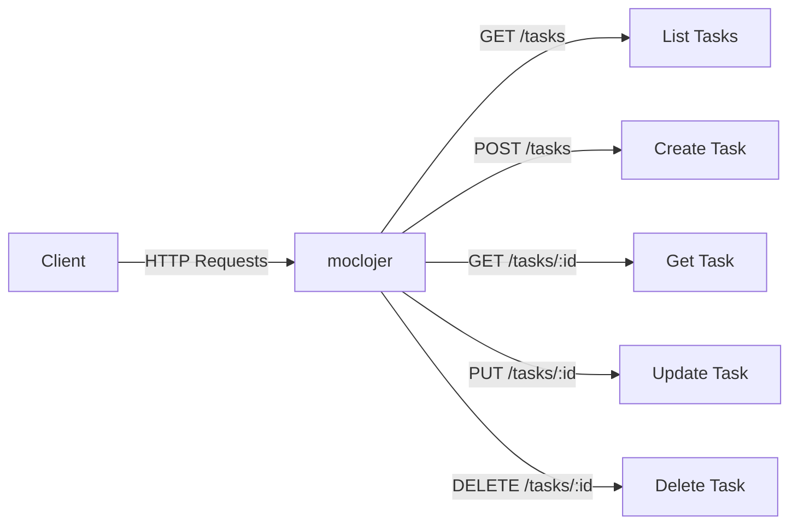

# Basic CRUD API Example

This example demonstrates a complete CRUD (Create, Read, Update, Delete) API for managing tasks. It's production-ready and includes proper error handling, validation, and RESTful conventions.

## 📋 What You'll Get

- ✅ Complete CRUD operations
- ✅ Proper HTTP status codes
- ✅ Error handling and validation
- ✅ Pagination support
- ✅ Search and filtering
- ✅ Ready-to-use configuration file

## 🎯 API Overview

### Architecture Diagram



### Endpoints

| Method | Path | Description | Status |
|--------|------|-------------|--------|
| GET | `/tasks` | List all tasks (with pagination) | 200 |
| GET | `/tasks/:id` | Get specific task | 200, 404 |
| POST | `/tasks` | Create new task | 201, 400 |
| PUT | `/tasks/:id` | Update task | 200, 404, 400 |
| DELETE | `/tasks/:id` | Delete task | 204, 404 |
| GET | `/tasks/search` | Search tasks | 200 |

## 📁 Configuration File

Create `tasks-api.yml`:

```yaml
# === HEALTH CHECK ===
- endpoint:
    method: GET
    path: /health
    response:
      status: 200
      headers:
        Content-Type: application/json
      body: >
        {
          "status": "ok",
          "service": "tasks-api",
          "version": "1.0.0",
          "timestamp": "{{now}}"
        }

# === LIST TASKS (with pagination) ===
- endpoint:
    method: GET
    path: /tasks
    response:
      status: 200
      headers:
        Content-Type: application/json
        X-Total-Count: "50"
      body: >
        {
          "tasks": [
            {
              "id": 1,
              "title": "Write documentation",
              "description": "Complete the API documentation",
              "status": "in_progress",
              "priority": "high",
              "created_at": "2024-01-10T09:00:00Z",
              "updated_at": "2024-01-15T14:30:00Z",
              "due_date": "2024-01-20T00:00:00Z"
            },
            {
              "id": 2,
              "title": "Review pull requests",
              "description": "Review pending PRs",
              "status": "todo",
              "priority": "medium",
              "created_at": "2024-01-12T10:00:00Z",
              "updated_at": "2024-01-12T10:00:00Z",
              "due_date": "2024-01-18T00:00:00Z"
            },
            {
              "id": 3,
              "title": "Deploy to production",
              "description": "Deploy version 2.0",
              "status": "done",
              "priority": "high",
              "created_at": "2024-01-08T08:00:00Z",
              "updated_at": "2024-01-14T16:00:00Z",
              "due_date": "2024-01-15T00:00:00Z"
            }
          ],
          "pagination": {
            "page": {{query-params.page|default:1}},
            "per_page": {{query-params.per_page|default:10}},
            "total": 50,
            "total_pages": 5
          }
        }

# === GET SPECIFIC TASK ===
- endpoint:
    method: GET
    path: /tasks/:id
    response:
      status: 200
      headers:
        Content-Type: application/json
      body: >
        {
          "id": {{path-params.id}},
          "title": "Task {{path-params.id}}",
          "description": "Description for task {{path-params.id}}",
          "status": "in_progress",
          "priority": "medium",
          "created_at": "2024-01-15T10:00:00Z",
          "updated_at": "2024-01-15T10:00:00Z",
          "due_date": "2024-01-20T00:00:00Z",
          "assignee": {
            "id": 42,
            "name": "John Doe",
            "email": "john@example.com"
          },
          "tags": ["backend", "api", "documentation"]
        }

# === CREATE TASK ===
- endpoint:
    method: POST
    path: /tasks
    response:
      status: 201
      headers:
        Content-Type: application/json
        Location: "/tasks/{{json-params.id|default:999}}"
      body: >
        {
          "id": {{json-params.id|default:999}},
          "title": "{{json-params.title}}",
          "description": "{{json-params.description}}",
          "status": "{{json-params.status|default:todo}}",
          "priority": "{{json-params.priority|default:medium}}",
          "created_at": "{{now}}",
          "updated_at": "{{now}}",
          "due_date": "{{json-params.due_date}}",
          "message": "Task created successfully"
        }

# === UPDATE TASK ===
- endpoint:
    method: PUT
    path: /tasks/:id
    response:
      status: 200
      headers:
        Content-Type: application/json
      body: >
        {
          "id": {{path-params.id}},
          "title": "{{json-params.title}}",
          "description": "{{json-params.description}}",
          "status": "{{json-params.status}}",
          "priority": "{{json-params.priority}}",
          "created_at": "2024-01-15T10:00:00Z",
          "updated_at": "{{now}}",
          "due_date": "{{json-params.due_date}}",
          "message": "Task updated successfully"
        }

# === DELETE TASK ===
- endpoint:
    method: DELETE
    path: /tasks/:id
    response:
      status: 204
      headers:
        Content-Type: application/json
      body: ""

# === SEARCH TASKS ===
- endpoint:
    method: GET
    path: /tasks/search
    response:
      status: 200
      headers:
        Content-Type: application/json
      body: >
        {
          "query": "{{query-params.q}}",
          "filters": {
            "status": "{{query-params.status}}",
            "priority": "{{query-params.priority}}",
            "assignee": "{{query-params.assignee}}"
          },
          "results": [
            {
              "id": 1,
              "title": "Task matching '{{query-params.q}}'",
              "description": "This task matches your search query",
              "status": "{{query-params.status|default:in_progress}}",
              "priority": "{{query-params.priority|default:medium}}",
              "relevance_score": 0.95
            }
          ],
          "total_results": 1
        }

# === ERROR RESPONSES ===

# Task not found
- endpoint:
    method: GET
    path: /tasks/999
    response:
      status: 404
      headers:
        Content-Type: application/json
      body: >
        {
          "error": "Not Found",
          "message": "Task with ID 999 not found",
          "code": "TASK_NOT_FOUND",
          "timestamp": "{{now}}"
        }

# Validation error
- endpoint:
    method: POST
    path: /tasks/invalid
    response:
      status: 400
      headers:
        Content-Type: application/json
      body: >
        {
          "error": "Bad Request",
          "message": "Validation failed",
          "code": "VALIDATION_ERROR",
          "errors": [
            {
              "field": "title",
              "message": "Title is required"
            },
            {
              "field": "title",
              "message": "Title must be at least 3 characters"
            }
          ],
          "timestamp": "{{now}}"
        }
```

## 🚀 Usage Examples

### Start the Server

```bash
moclojer --config tasks-api.yml --port 8000
```

### 1. List All Tasks

```bash
curl http://localhost:8000/tasks
```

**With pagination:**

```bash
curl "http://localhost:8000/tasks?page=2&per_page=5"
```

### 2. Get Specific Task

```bash
curl http://localhost:8000/tasks/1
```

### 3. Create New Task

```bash
curl -X POST http://localhost:8000/tasks \
  -H "Content-Type: application/json" \
  -d '{
    "title": "Fix bug in authentication",
    "description": "Users unable to log in with Google",
    "status": "todo",
    "priority": "high",
    "due_date": "2024-01-25T00:00:00Z"
  }'
```

### 4. Update Task

```bash
curl -X PUT http://localhost:8000/tasks/1 \
  -H "Content-Type: application/json" \
  -d '{
    "title": "Write documentation (Updated)",
    "description": "Complete and review API documentation",
    "status": "done",
    "priority": "high",
    "due_date": "2024-01-20T00:00:00Z"
  }'
```

### 5. Delete Task

```bash
curl -X DELETE http://localhost:8000/tasks/1
```

### 6. Search Tasks

```bash
# Search by query
curl "http://localhost:8000/tasks/search?q=documentation"

# Filter by status
curl "http://localhost:8000/tasks/search?status=in_progress"

# Multiple filters
curl "http://localhost:8000/tasks/search?status=todo&priority=high"
```

### 7. Test Error Cases

```bash
# Not found (404)
curl http://localhost:8000/tasks/999

# Validation error (400)
curl -X POST http://localhost:8000/tasks/invalid
```

## 📊 Testing Script

Create `test-tasks-api.sh`:

```bash
#!/bin/bash

BASE_URL="http://localhost:8000"

echo "🧪 Testing Tasks API"
echo "===================="

# Test 1: Health check
echo -e "\n✅ Test 1: Health Check"
curl -s $BASE_URL/health | jq

# Test 2: List tasks
echo -e "\n✅ Test 2: List Tasks"
curl -s $BASE_URL/tasks | jq '.tasks[] | {id, title, status}'

# Test 3: Get specific task
echo -e "\n✅ Test 3: Get Task #1"
curl -s $BASE_URL/tasks/1 | jq

# Test 4: Create task
echo -e "\n✅ Test 4: Create Task"
curl -s -X POST $BASE_URL/tasks \
  -H "Content-Type: application/json" \
  -d '{"title":"New task","description":"Test task","status":"todo","priority":"low"}' | jq

# Test 5: Update task
echo -e "\n✅ Test 5: Update Task #2"
curl -s -X PUT $BASE_URL/tasks/2 \
  -H "Content-Type: application/json" \
  -d '{"title":"Updated task","status":"in_progress","priority":"high"}' | jq

# Test 6: Search
echo -e "\n✅ Test 6: Search Tasks"
curl -s "$BASE_URL/tasks/search?q=documentation&status=in_progress" | jq

# Test 7: Delete
echo -e "\n✅ Test 7: Delete Task #3"
curl -s -X DELETE $BASE_URL/tasks/3 -w "\nStatus: %{http_code}\n"

# Test 8: Error - Not found
echo -e "\n❌ Test 8: Not Found (404)"
curl -s $BASE_URL/tasks/999 | jq

# Test 9: Error - Validation
echo -e "\n❌ Test 9: Validation Error (400)"
curl -s -X POST $BASE_URL/tasks/invalid | jq

echo -e "\n✅ All tests completed!"
```

**Run tests:**

```bash
chmod +x test-tasks-api.sh
./test-tasks-api.sh
```

## 🎓 Learning Points

### HTTP Status Codes

- **200 OK** - Successful GET, PUT
- **201 Created** - Successful POST (resource created)
- **204 No Content** - Successful DELETE (no response body)
- **400 Bad Request** - Validation errors
- **404 Not Found** - Resource doesn't exist

### RESTful Conventions

- **Resource naming**: Plural nouns (`/tasks`, not `/task`)
- **HTTP methods**: Match CRUD operations semantically
- **Status codes**: Use appropriate codes for each response
- **Location header**: Return URL of created resource

### Best Practices Demonstrated

✅ Consistent response format across endpoints
✅ Pagination metadata for list endpoints
✅ Detailed error messages with codes
✅ Timestamps for audit trail
✅ Search and filtering capabilities

## 🔗 Related Documentation

- **[CRUD Operations Guide](../../how-to/patterns/crud-operations.md)** - Detailed CRUD patterns
- **[HTTP Methods](../../topics/endpoints/http-methods.md)** - Complete HTTP methods reference
- **[Path Parameters](../../topics/parameters/path-parameters.md)** - Dynamic URL parameters
- **[Query Parameters](../../topics/parameters/query-parameters.md)** - Filters and pagination
- **[Body Parameters](../../topics/parameters/body-parameters.md)** - JSON request handling

## 🚀 Next Steps

- **[Blog API Example](blog-api.md)** - More complex example with nested resources
- **[Pagination Guide](../../how-to/patterns/pagination.md)** - Advanced pagination strategies
- **[Error Handling](../../how-to/patterns/error-handling.md)** - Comprehensive error patterns

---

**💡 Tip:** This example is production-ready! You can use it as a template for your own CRUD APIs.
