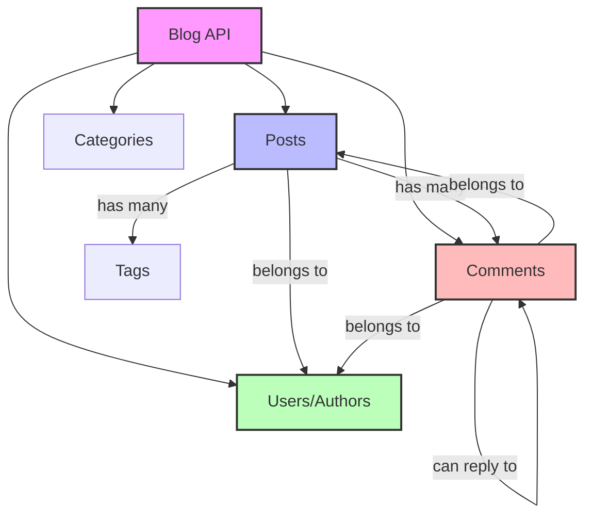

# Blog API Example

A complete blog API demonstrating advanced concepts like nested resources, relationships between entities, comments threading, and content management.

## 📋 What You'll Get

- ✅ Posts with authors and categories
- ✅ Nested comments with threading
- ✅ User management and authentication
- ✅ Tags and categorization
- ✅ Search and filtering
- ✅ Publish/draft workflow

## 🏗️ Architecture Diagram



## 🎯 API Overview

### Core Endpoints

| Resource | Method | Path | Description |
|----------|--------|------|-------------|
| **Posts** | GET | `/posts` | List all posts |
| | GET | `/posts/:id` | Get specific post |
| | POST | `/posts` | Create post |
| | PUT | `/posts/:id` | Update post |
| | DELETE | `/posts/:id` | Delete post |
| **Comments** | GET | `/posts/:postId/comments` | List post comments |
| | POST | `/posts/:postId/comments` | Add comment |
| | GET | `/comments/:id` | Get comment |
| | DELETE | `/comments/:id` | Delete comment |
| **Authors** | GET | `/authors` | List authors |
| | GET | `/authors/:id` | Get author |
| | GET | `/authors/:id/posts` | Author's posts |
| **Categories** | GET | `/categories` | List categories |
| | GET | `/categories/:slug/posts` | Category posts |

## 📁 Configuration File

Create `blog-api.yml`:

```yaml
# === HEALTH & INFO ===
- endpoint:
    method: GET
    path: /api/v1/info
    response:
      status: 200
      headers:
        Content-Type: application/json
      body: >
        {
          "name": "Blog API",
          "version": "1.0.0",
          "description": "RESTful blog API with posts, comments, and authors",
          "endpoints": {
            "posts": "/api/v1/posts",
            "authors": "/api/v1/authors",
            "categories": "/api/v1/categories"
          }
        }

# === POSTS ===

# List all posts
- endpoint:
    method: GET
    path: /api/v1/posts
    response:
      status: 200
      headers:
        Content-Type: application/json
        X-Total-Count: "156"
      body: >
        {
          "posts": [
            {
              "id": 1,
              "title": "Getting Started with moclojer",
              "slug": "getting-started-with-moclojer",
              "excerpt": "Learn how to create mock APIs in minutes",
              "author": {
                "id": 1,
                "name": "Alice Johnson",
                "username": "alice",
                "avatar": "https://example.com/avatars/alice.jpg"
              },
              "category": {
                "id": 1,
                "name": "Tutorial",
                "slug": "tutorial"
              },
              "tags": ["moclojer", "api", "tutorial"],
              "status": "{{query-params.status|default:published}}",
              "published_at": "2024-01-15T10:00:00Z",
              "comments_count": 12,
              "views": 1523
            },
            {
              "id": 2,
              "title": "Advanced API Mocking Techniques",
              "slug": "advanced-api-mocking",
              "excerpt": "Deep dive into advanced mocking patterns",
              "author": {
                "id": 2,
                "name": "Bob Smith",
                "username": "bob",
                "avatar": "https://example.com/avatars/bob.jpg"
              },
              "category": {
                "id": 2,
                "name": "Advanced",
                "slug": "advanced"
              },
              "tags": ["moclojer", "advanced", "patterns"],
              "status": "published",
              "published_at": "2024-01-14T14:30:00Z",
              "comments_count": 8,
              "views": 987
            }
          ],
          "pagination": {
            "page": {{query-params.page|default:1}},
            "per_page": {{query-params.per_page|default:10}},
            "total": 156,
            "total_pages": 16
          }
        }

# Get specific post
- endpoint:
    method: GET
    path: /api/v1/posts/:id
    response:
      status: 200
      headers:
        Content-Type: application/json
      body: >
        {
          "id": {{path-params.id}},
          "title": "Post Title {{path-params.id}}",
          "slug": "post-title-{{path-params.id}}",
          "content": "# Introduction\n\nThis is the full content of the blog post...\n\n## Section 1\n\nLorem ipsum dolor sit amet...",
          "excerpt": "Short description of the post",
          "author": {
            "id": 1,
            "name": "Alice Johnson",
            "username": "alice",
            "email": "alice@example.com",
            "bio": "Tech writer and developer",
            "avatar": "https://example.com/avatars/alice.jpg",
            "social": {
              "twitter": "@alice",
              "github": "alice"
            }
          },
          "category": {
            "id": 1,
            "name": "Tutorial",
            "slug": "tutorial",
            "description": "Step-by-step tutorials"
          },
          "tags": ["moclojer", "api", "tutorial", "beginner"],
          "status": "published",
          "featured_image": "https://example.com/images/post-{{path-params.id}}.jpg",
          "created_at": "2024-01-10T09:00:00Z",
          "updated_at": "2024-01-15T10:00:00Z",
          "published_at": "2024-01-15T10:00:00Z",
          "comments_count": 12,
          "views": 1523,
          "reading_time_minutes": 8
        }

# Create post
- endpoint:
    method: POST
    path: /api/v1/posts
    response:
      status: 201
      headers:
        Content-Type: application/json
        Location: "/api/v1/posts/{{json-params.id|default:999}}"
      body: >
        {
          "id": {{json-params.id|default:999}},
          "title": "{{json-params.title}}",
          "slug": "{{json-params.slug}}",
          "content": "{{json-params.content}}",
          "excerpt": "{{json-params.excerpt}}",
          "author_id": {{json-params.author_id}},
          "category_id": {{json-params.category_id}},
          "tags": {{json-params.tags}},
          "status": "{{json-params.status|default:draft}}",
          "created_at": "{{now}}",
          "updated_at": "{{now}}",
          "message": "Post created successfully"
        }

# Update post
- endpoint:
    method: PUT
    path: /api/v1/posts/:id
    response:
      status: 200
      headers:
        Content-Type: application/json
      body: >
        {
          "id": {{path-params.id}},
          "title": "{{json-params.title}}",
          "content": "{{json-params.content}}",
          "status": "{{json-params.status}}",
          "updated_at": "{{now}}",
          "message": "Post updated successfully"
        }

# === COMMENTS ===

# List post comments
- endpoint:
    method: GET
    path: /api/v1/posts/:postId/comments
    response:
      status: 200
      headers:
        Content-Type: application/json
      body: >
        {
          "post_id": {{path-params.postId}},
          "comments": [
            {
              "id": 1,
              "content": "Great article! Very helpful.",
              "author": {
                "id": 3,
                "name": "Carol Davis",
                "username": "carol",
                "avatar": "https://example.com/avatars/carol.jpg"
              },
              "created_at": "2024-01-15T11:30:00Z",
              "updated_at": "2024-01-15T11:30:00Z",
              "likes": 5,
              "replies_count": 2,
              "parent_id": null
            },
            {
              "id": 2,
              "content": "Thanks! Glad it helped.",
              "author": {
                "id": 1,
                "name": "Alice Johnson",
                "username": "alice",
                "avatar": "https://example.com/avatars/alice.jpg"
              },
              "created_at": "2024-01-15T12:00:00Z",
              "updated_at": "2024-01-15T12:00:00Z",
              "likes": 2,
              "replies_count": 0,
              "parent_id": 1
            }
          ],
          "total": 12
        }

# Create comment
- endpoint:
    method: POST
    path: /api/v1/posts/:postId/comments
    response:
      status: 201
      headers:
        Content-Type: application/json
      body: >
        {
          "id": {{json-params.id|default:999}},
          "post_id": {{path-params.postId}},
          "content": "{{json-params.content}}",
          "author_id": {{json-params.author_id}},
          "parent_id": {{json-params.parent_id}},
          "created_at": "{{now}}",
          "likes": 0,
          "message": "Comment added successfully"
        }

# === AUTHORS ===

# List authors
- endpoint:
    method: GET
    path: /api/v1/authors
    response:
      status: 200
      headers:
        Content-Type: application/json
      body: >
        {
          "authors": [
            {
              "id": 1,
              "name": "Alice Johnson",
              "username": "alice",
              "bio": "Tech writer and developer advocate",
              "avatar": "https://example.com/avatars/alice.jpg",
              "posts_count": 45,
              "followers": 1234
            },
            {
              "id": 2,
              "name": "Bob Smith",
              "username": "bob",
              "bio": "Software engineer and blogger",
              "avatar": "https://example.com/avatars/bob.jpg",
              "posts_count": 32,
              "followers": 987
            }
          ],
          "total": 12
        }

# Get author profile
- endpoint:
    method: GET
    path: /api/v1/authors/:id
    response:
      status: 200
      headers:
        Content-Type: application/json
      body: >
        {
          "id": {{path-params.id}},
          "name": "Author {{path-params.id}}",
          "username": "author{{path-params.id}}",
          "email": "author{{path-params.id}}@example.com",
          "bio": "Passionate about technology and writing",
          "avatar": "https://example.com/avatars/{{path-params.id}}.jpg",
          "social": {
            "twitter": "@author{{path-params.id}}",
            "github": "author{{path-params.id}}",
            "linkedin": "author-{{path-params.id}}"
          },
          "stats": {
            "posts_count": 45,
            "comments_count": 123,
            "followers": 1234,
            "following": 567
          },
          "joined_at": "2023-06-15T00:00:00Z"
        }

# Get author's posts
- endpoint:
    method: GET
    path: /api/v1/authors/:id/posts
    response:
      status: 200
      headers:
        Content-Type: application/json
      body: >
        {
          "author": {
            "id": {{path-params.id}},
            "name": "Author {{path-params.id}}",
            "username": "author{{path-params.id}}"
          },
          "posts": [
            {
              "id": 1,
              "title": "First post by author {{path-params.id}}",
              "slug": "first-post-author-{{path-params.id}}",
              "excerpt": "Introduction to my blog",
              "published_at": "2024-01-15T10:00:00Z",
              "views": 1523
            }
          ],
          "total": 45
        }

# === CATEGORIES ===

# List categories
- endpoint:
    method: GET
    path: /api/v1/categories
    response:
      status: 200
      headers:
        Content-Type: application/json
      body: >
        {
          "categories": [
            {
              "id": 1,
              "name": "Tutorial",
              "slug": "tutorial",
              "description": "Step-by-step guides",
              "posts_count": 45,
              "color": "#3498db"
            },
            {
              "id": 2,
              "name": "Advanced",
              "slug": "advanced",
              "description": "Advanced topics and techniques",
              "posts_count": 28,
              "color": "#e74c3c"
            },
            {
              "id": 3,
              "name": "News",
              "slug": "news",
              "description": "Latest updates and announcements",
              "posts_count": 67,
              "color": "#2ecc71"
            }
          ]
        }

# Get category posts
- endpoint:
    method: GET
    path: /api/v1/categories/:slug/posts
    response:
      status: 200
      headers:
        Content-Type: application/json
      body: >
        {
          "category": {
            "name": "{{path-params.slug|capitalize}}",
            "slug": "{{path-params.slug}}",
            "description": "Posts in {{path-params.slug}} category"
          },
          "posts": [
            {
              "id": 1,
              "title": "Post in {{path-params.slug}} category",
              "published_at": "2024-01-15T10:00:00Z"
            }
          ],
          "total": 45
        }

# === SEARCH ===

# Search posts
- endpoint:
    method: GET
    path: /api/v1/search
    response:
      status: 200
      headers:
        Content-Type: application/json
      body: >
        {
          "query": "{{query-params.q}}",
          "filters": {
            "category": "{{query-params.category}}",
            "author": "{{query-params.author}}",
            "tag": "{{query-params.tag}}"
          },
          "results": [
            {
              "type": "post",
              "id": 1,
              "title": "Result matching '{{query-params.q}}'",
              "excerpt": "This post matches your search query",
              "relevance": 0.95,
              "url": "/api/v1/posts/1"
            }
          ],
          "total": 23
        }
```

## 🚀 Usage Examples

### Start Server

```bash
moclojer --config blog-api.yml --port 8000
```

### Posts Management

```bash
# List posts
curl http://localhost:8000/api/v1/posts

# Get specific post
curl http://localhost:8000/api/v1/posts/1

# Create post
curl -X POST http://localhost:8000/api/v1/posts \
  -H "Content-Type: application/json" \
  -d '{
    "title": "My First Blog Post",
    "slug": "my-first-blog-post",
    "content": "# Hello World\n\nThis is my first post!",
    "excerpt": "Introduction to my blog",
    "author_id": 1,
    "category_id": 1,
    "tags": ["intro", "welcome"],
    "status": "published"
  }'

# Update post
curl -X PUT http://localhost:8000/api/v1/posts/1 \
  -H "Content-Type: application/json" \
  -d '{
    "title": "Updated Title",
    "content": "Updated content...",
    "status": "published"
  }'
```

### Comments

```bash
# List post comments
curl http://localhost:8000/api/v1/posts/1/comments

# Add comment
curl -X POST http://localhost:8000/api/v1/posts/1/comments \
  -H "Content-Type: application/json" \
  -d '{
    "content": "Great article!",
    "author_id": 3
  }'

# Reply to comment (threaded)
curl -X POST http://localhost:8000/api/v1/posts/1/comments \
  -H "Content-Type: application/json" \
  -d '{
    "content": "Thanks!",
    "author_id": 1,
    "parent_id": 1
  }'
```

### Authors & Categories

```bash
# List authors
curl http://localhost:8000/api/v1/authors

# Get author profile
curl http://localhost:8000/api/v1/authors/1

# Get author's posts
curl http://localhost:8000/api/v1/authors/1/posts

# List categories
curl http://localhost:8000/api/v1/categories

# Get category posts
curl http://localhost:8000/api/v1/categories/tutorial/posts
```

### Search & Filter

```bash
# Search posts
curl "http://localhost:8000/api/v1/search?q=moclojer"

# Filter by category
curl "http://localhost:8000/api/v1/posts?category=tutorial"

# Filter by author
curl "http://localhost:8000/api/v1/posts?author=alice"

# Multiple filters
curl "http://localhost:8000/api/v1/search?q=api&category=tutorial&tag=beginner"
```

## 🎓 Key Concepts Demonstrated

### 1. Nested Resources
```
/posts/:postId/comments     # Comments belong to posts
/authors/:id/posts          # Posts belong to authors
/categories/:slug/posts     # Posts belong to categories
```

### 2. Resource Relationships
- **One-to-Many**: Author has many Posts
- **One-to-Many**: Post has many Comments
- **Many-to-Many**: Posts have many Tags
- **Self-Referential**: Comments reply to Comments (threading)

### 3. Content Workflow
- **Draft** → **Published** → **Archived**
- Author can edit their own posts
- Moderator can approve comments

## 🔗 Related Documentation

- **[Basic CRUD Example](basic-crud.md)** - Simpler CRUD example
- **[Nested Resources](../../topics/endpoints/nested-resources.md)** - Nested endpoint patterns (TODO)
- **[Pagination Guide](../../how-to/patterns/pagination.md)** - Advanced pagination
- **[Query Parameters](../../topics/parameters/query-parameters.md)** - Filters and search

## 🚀 Next Steps

- **[Stripe Mock](../third-party/stripe-mock.md)** - Third-party API example
- **[Authentication Patterns](../../how-to/patterns/authentication-mock.md)** - Auth implementation (TODO)

---

**💡 This example demonstrates production-grade blog API patterns used by platforms like Medium, Dev.to, and Hashnode!**
