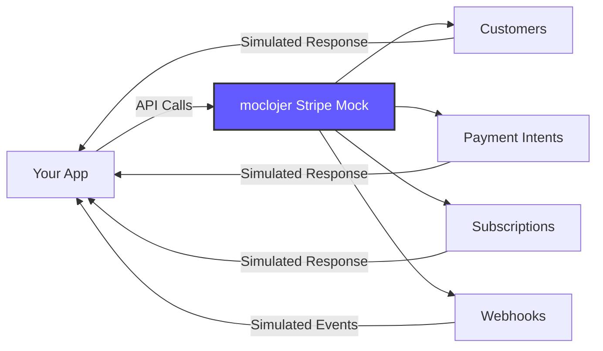

# Stripe API Mock

Mock the Stripe payment API for testing payment integrations without real transactions, API keys, or network calls. Perfect for local development, CI/CD pipelines, and automated testing.

## 📋 What You'll Get

- ✅ Customers API (create, retrieve, update)
- ✅ Payment Intents (create, confirm, capture)
- ✅ Subscriptions management
- ✅ Webhook events simulation
- ✅ Error scenarios (declined cards, etc.)
- ✅ Realistic Stripe response format

## 🎯 Stripe API Coverage

### Architecture Diagram



## 🔑 Supported Endpoints

| Resource | Method | Path | Description |
|----------|--------|------|-------------|
| **Customers** | POST | `/v1/customers` | Create customer |
| | GET | `/v1/customers/:id` | Retrieve customer |
| | POST | `/v1/customers/:id` | Update customer |
| **Payment Intents** | POST | `/v1/payment_intents` | Create payment intent |
| | GET | `/v1/payment_intents/:id` | Retrieve payment intent |
| | POST | `/v1/payment_intents/:id/confirm` | Confirm payment |
| **Subscriptions** | POST | `/v1/subscriptions` | Create subscription |
| | GET | `/v1/subscriptions/:id` | Retrieve subscription |
| | DELETE | `/v1/subscriptions/:id` | Cancel subscription |
| **Webhooks** | POST | `/v1/webhook` | Receive webhook events |

## 📁 Configuration File

Create `stripe-mock.yml`:

```yaml
# === CUSTOMERS ===

# Create customer
- endpoint:
    method: POST
    path: /v1/customers
    response:
      status: 200
      headers:
        Content-Type: application/json
      body: >
        {
          "id": "cus_{{json-params.metadata.user_id|default:ABC123}}",
          "object": "customer",
          "address": null,
          "balance": 0,
          "created": {{now|timestamp}},
          "currency": "usd",
          "default_source": null,
          "delinquent": false,
          "description": "{{json-params.description}}",
          "discount": null,
          "email": "{{json-params.email}}",
          "invoice_prefix": "INV",
          "invoice_settings": {
            "custom_fields": null,
            "default_payment_method": null,
            "footer": null
          },
          "livemode": false,
          "metadata": {{json-params.metadata|default:{}}},
          "name": "{{json-params.name}}",
          "phone": "{{json-params.phone}}",
          "preferred_locales": [],
          "shipping": null,
          "tax_exempt": "none"
        }

# Get customer
- endpoint:
    method: GET
    path: /v1/customers/:id
    response:
      status: 200
      headers:
        Content-Type: application/json
      body: >
        {
          "id": "{{path-params.id}}",
          "object": "customer",
          "address": null,
          "balance": 0,
          "created": 1640000000,
          "currency": "usd",
          "default_source": null,
          "delinquent": false,
          "description": "Customer for {{path-params.id}}",
          "discount": null,
          "email": "customer-{{path-params.id}}@example.com",
          "invoice_prefix": "INV",
          "livemode": false,
          "metadata": {},
          "name": "Customer {{path-params.id}}",
          "phone": null,
          "shipping": null,
          "tax_exempt": "none"
        }

# === PAYMENT INTENTS ===

# Create payment intent
- endpoint:
    method: POST
    path: /v1/payment_intents
    response:
      status: 200
      headers:
        Content-Type: application/json
      body: >
        {
          "id": "pi_{{json-params.customer|default:ABC123}}",
          "object": "payment_intent",
          "amount": {{json-params.amount}},
          "amount_capturable": 0,
          "amount_received": 0,
          "application": null,
          "application_fee_amount": null,
          "canceled_at": null,
          "cancellation_reason": null,
          "capture_method": "{{json-params.capture_method|default:automatic}}",
          "charges": {
            "object": "list",
            "data": [],
            "has_more": false,
            "total_count": 0,
            "url": "/v1/charges?payment_intent=pi_{{json-params.customer}}"
          },
          "client_secret": "pi_{{json-params.customer}}_secret_{{json-params.amount}}",
          "confirmation_method": "automatic",
          "created": {{now|timestamp}},
          "currency": "{{json-params.currency|default:usd}}",
          "customer": "{{json-params.customer}}",
          "description": "{{json-params.description}}",
          "invoice": null,
          "last_payment_error": null,
          "livemode": false,
          "metadata": {{json-params.metadata|default:{}}},
          "next_action": null,
          "on_behalf_of": null,
          "payment_method": null,
          "payment_method_options": {},
          "payment_method_types": ["card"],
          "receipt_email": "{{json-params.receipt_email}}",
          "review": null,
          "setup_future_usage": null,
          "shipping": null,
          "source": null,
          "statement_descriptor": null,
          "statement_descriptor_suffix": null,
          "status": "requires_payment_method",
          "transfer_data": null,
          "transfer_group": null
        }

# Get payment intent
- endpoint:
    method: GET
    path: /v1/payment_intents/:id
    response:
      status: 200
      headers:
        Content-Type: application/json
      body: >
        {
          "id": "{{path-params.id}}",
          "object": "payment_intent",
          "amount": 5000,
          "amount_capturable": 0,
          "amount_received": 5000,
          "canceled_at": null,
          "cancellation_reason": null,
          "capture_method": "automatic",
          "client_secret": "{{path-params.id}}_secret",
          "confirmation_method": "automatic",
          "created": 1640000000,
          "currency": "usd",
          "customer": "cus_ABC123",
          "description": "Payment for order #123",
          "status": "succeeded",
          "charges": {
            "object": "list",
            "data": [
              {
                "id": "ch_123",
                "object": "charge",
                "amount": 5000,
                "paid": true,
                "status": "succeeded"
              }
            ],
            "has_more": false,
            "total_count": 1
          }
        }

# Confirm payment intent
- endpoint:
    method: POST
    path: /v1/payment_intents/:id/confirm
    response:
      status: 200
      headers:
        Content-Type: application/json
      body: >
        {
          "id": "{{path-params.id}}",
          "object": "payment_intent",
          "amount": 5000,
          "amount_received": 5000,
          "canceled_at": null,
          "capture_method": "automatic",
          "client_secret": "{{path-params.id}}_secret",
          "created": {{now|timestamp}},
          "currency": "usd",
          "customer": "cus_ABC123",
          "payment_method": "pm_card_visa",
          "status": "succeeded",
          "charges": {
            "object": "list",
            "data": [
              {
                "id": "ch_{{path-params.id}}",
                "amount": 5000,
                "paid": true,
                "status": "succeeded",
                "payment_method_details": {
                  "card": {
                    "brand": "visa",
                    "last4": "4242",
                    "exp_month": 12,
                    "exp_year": 2025
                  },
                  "type": "card"
                }
              }
            ],
            "total_count": 1
          }
        }

# === SUBSCRIPTIONS ===

# Create subscription
- endpoint:
    method: POST
    path: /v1/subscriptions
    response:
      status: 200
      headers:
        Content-Type: application/json
      body: >
        {
          "id": "sub_{{json-params.customer}}",
          "object": "subscription",
          "application_fee_percent": null,
          "billing_cycle_anchor": {{now|timestamp}},
          "billing_thresholds": null,
          "cancel_at": null,
          "cancel_at_period_end": false,
          "canceled_at": null,
          "collection_method": "charge_automatically",
          "created": {{now|timestamp}},
          "current_period_end": {{now|timestamp|add:2592000}},
          "current_period_start": {{now|timestamp}},
          "customer": "{{json-params.customer}}",
          "days_until_due": null,
          "default_payment_method": null,
          "default_source": null,
          "default_tax_rates": [],
          "discount": null,
          "ended_at": null,
          "items": {
            "object": "list",
            "data": [
              {
                "id": "si_{{json-params.customer}}",
                "object": "subscription_item",
                "billing_thresholds": null,
                "created": {{now|timestamp}},
                "metadata": {},
                "price": {
                  "id": "{{json-params.items[0].price}}",
                  "object": "price",
                  "active": true,
                  "billing_scheme": "per_unit",
                  "currency": "usd",
                  "livemode": false,
                  "recurring": {
                    "interval": "month",
                    "interval_count": 1
                  },
                  "type": "recurring",
                  "unit_amount": 2000
                },
                "quantity": 1,
                "subscription": "sub_{{json-params.customer}}"
              }
            ],
            "has_more": false,
            "total_count": 1
          },
          "latest_invoice": "in_{{json-params.customer}}",
          "livemode": false,
          "metadata": {{json-params.metadata|default:{}}},
          "next_pending_invoice_item_invoice": null,
          "pause_collection": null,
          "pending_invoice_item_interval": null,
          "pending_setup_intent": null,
          "pending_update": null,
          "plan": null,
          "quantity": 1,
          "schedule": null,
          "start_date": {{now|timestamp}},
          "status": "active",
          "transfer_data": null,
          "trial_end": null,
          "trial_start": null
        }

# Get subscription
- endpoint:
    method: GET
    path: /v1/subscriptions/:id
    response:
      status: 200
      headers:
        Content-Type: application/json
      body: >
        {
          "id": "{{path-params.id}}",
          "object": "subscription",
          "cancel_at_period_end": false,
          "canceled_at": null,
          "created": 1640000000,
          "current_period_end": 1642592000,
          "current_period_start": 1640000000,
          "customer": "cus_ABC123",
          "status": "active",
          "items": {
            "data": [
              {
                "id": "si_123",
                "price": {
                  "id": "price_pro",
                  "recurring": {
                    "interval": "month"
                  },
                  "unit_amount": 2000
                },
                "quantity": 1
              }
            ]
          }
        }

# Cancel subscription
- endpoint:
    method: DELETE
    path: /v1/subscriptions/:id
    response:
      status: 200
      headers:
        Content-Type: application/json
      body: >
        {
          "id": "{{path-params.id}}",
          "object": "subscription",
          "canceled_at": {{now|timestamp}},
          "cancel_at_period_end": false,
          "status": "canceled",
          "ended_at": {{now|timestamp}}
        }

# === ERROR SCENARIOS ===

# Declined card
- endpoint:
    method: POST
    path: /v1/payment_intents/pi_declined/confirm
    response:
      status: 402
      headers:
        Content-Type: application/json
      body: >
        {
          "error": {
            "type": "card_error",
            "code": "card_declined",
            "decline_code": "generic_decline",
            "message": "Your card was declined.",
            "param": "payment_method",
            "payment_intent": {
              "id": "pi_declined",
              "object": "payment_intent",
              "status": "requires_payment_method",
              "last_payment_error": {
                "type": "card_error",
                "code": "card_declined",
                "decline_code": "generic_decline",
                "message": "Your card was declined."
              }
            }
          }
        }

# Insufficient funds
- endpoint:
    method: POST
    path: /v1/payment_intents/pi_insufficient/confirm
    response:
      status: 402
      headers:
        Content-Type: application/json
      body: >
        {
          "error": {
            "type": "card_error",
            "code": "card_declined",
            "decline_code": "insufficient_funds",
            "message": "Your card has insufficient funds.",
            "param": "payment_method"
          }
        }

# Invalid API key
- endpoint:
    method: GET
    path: /v1/invalid-key
    response:
      status: 401
      headers:
        Content-Type: application/json
      body: >
        {
          "error": {
            "type": "invalid_request_error",
            "message": "Invalid API Key provided: sk_test_****invalid"
          }
        }
```

## 🚀 Usage Examples

### Start Server

```bash
moclojer --config stripe-mock.yml --port 8000
```

### Customer Operations

```bash
# Create customer
curl -X POST http://localhost:8000/v1/customers \
  -H "Content-Type: application/json" \
  -d '{
    "name": "John Doe",
    "email": "john@example.com",
    "phone": "+1234567890",
    "description": "Premium customer",
    "metadata": {
      "user_id": "user_123",
      "plan": "premium"
    }
  }'

# Get customer
curl http://localhost:8000/v1/customers/cus_ABC123
```

### Payment Intents

```bash
# Create payment intent
curl -X POST http://localhost:8000/v1/payment_intents \
  -H "Content-Type: application/json" \
  -d '{
    "amount": 5000,
    "currency": "usd",
    "customer": "cus_ABC123",
    "description": "Payment for Order #123",
    "receipt_email": "john@example.com",
    "metadata": {
      "order_id": "order_123"
    }
  }'

# Confirm payment intent
curl -X POST http://localhost:8000/v1/payment_intents/pi_ABC123/confirm \
  -H "Content-Type: application/json" \
  -d '{
    "payment_method": "pm_card_visa"
  }'

# Get payment intent
curl http://localhost:8000/v1/payment_intents/pi_ABC123
```

### Subscriptions

```bash
# Create subscription
curl -X POST http://localhost:8000/v1/subscriptions \
  -H "Content-Type: application/json" \
  -d '{
    "customer": "cus_ABC123",
    "items": [
      {"price": "price_premium_monthly"}
    ],
    "metadata": {
      "plan": "premium"
    }
  }'

# Get subscription
curl http://localhost:8000/v1/subscriptions/sub_ABC123

# Cancel subscription
curl -X DELETE http://localhost:8000/v1/subscriptions/sub_ABC123
```

### Test Error Scenarios

```bash
# Simulate declined card
curl -X POST http://localhost:8000/v1/payment_intents/pi_declined/confirm

# Simulate insufficient funds
curl -X POST http://localhost:8000/v1/payment_intents/pi_insufficient/confirm
```

## 🔍 Integration Example (Node.js)

```javascript
// Configure to use mock instead of real Stripe
const stripe = require('stripe')('sk_test_mock_key');

// Override base URL to point to mock
stripe.setHost('localhost');
stripe.setPort(8000);
stripe.setProtocol('http');

// Now use Stripe SDK normally
async function createPayment() {
  try {
    // Create customer
    const customer = await stripe.customers.create({
      name: 'John Doe',
      email: 'john@example.com',
      metadata: { user_id: 'user_123' }
    });

    // Create payment intent
    const paymentIntent = await stripe.paymentIntents.create({
      amount: 5000,
      currency: 'usd',
      customer: customer.id,
      description: 'Test payment'
    });

    // Confirm payment
    const confirmed = await stripe.paymentIntents.confirm(paymentIntent.id, {
      payment_method: 'pm_card_visa'
    });

    console.log('Payment succeeded:', confirmed.id);
  } catch (error) {
    console.error('Payment failed:', error.message);
  }
}
```

## 🎓 Use Cases

### 1. **Local Development**

Test payment flows without real Stripe account or internet connection.

### 2. **CI/CD Pipelines**

Run automated tests without external dependencies or API rate limits.

### 3. **Frontend Development**

Build payment UIs before backend integration is ready.

### 4. **Error Handling Testing**

Simulate all error scenarios (declined cards, insufficient funds, etc.).

### 5. **Load Testing**

Test payment performance without hitting Stripe API limits.

## ⚠️ Important Notes

### Limitations

- **Not a complete Stripe implementation** - Only core endpoints
- **No real validation** - Mock accepts any input
- **No persistence** - Data isn't saved between requests
- **Simplified responses** - Some fields may be missing

### Security

- **Never use in production** - This is for testing only
- **No PCI compliance** - Not designed to handle real card data
- **No encryption** - Use only in local/test environments

## 🔗 Related Documentation

- **[Basic CRUD Example](../rest-api/basic-crud.md)** - CRUD fundamentals
- **[Webhook Integration](../../advanced/webhook-integration.md)** - Webhook simulation
- **[Error Handling Patterns](../../how-to/patterns/error-handling.md)** - Error responses
- **Real Stripe Documentation**: [https://stripe.com/docs/api](https://stripe.com/docs/api)

---

**💡 Tip:** Use this mock during development, then switch to [Stripe Test Mode](https://stripe.com/docs/testing) for integration testing, and finally to production mode for live transactions.
